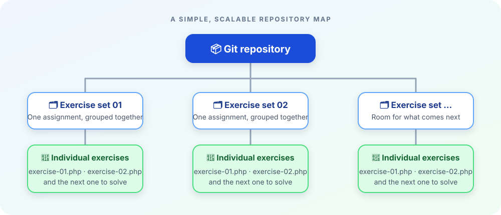

# 🐘 PHP Exercise Repository

> A structured collection of PHP exercises, organized by assignment set and built one problem at a time.

This repository keeps PHP practice work easy to browse, review, and revisit. Each top-level folder represents a **set of exercises**; each set contains the individual exercises for that assignment.

The goal is simple: keep the work organized enough that future-you can find it without asking present-you what `final-final-v2.php` was supposed to mean.

%%{init: {"flowchart": {"curve": "linear", "nodeSpacing": 55, "rankSpacing": 65}, "theme": "base", "themeVariables": {"primaryColor": "#eff6ff", "primaryTextColor": "#172554", "primaryBorderColor": "#2563eb", "lineColor": "#64748b", "secondaryColor": "#f0fdf4", "tertiaryColor": "#fff7ed"}}}%%
flowchart TB
    G([📦 Git repository])
    G --> R1[🗂️ Exercise set 01]
    G --> R2[🗂️ Exercise set 02]
    G --> R3[🗂️ Exercise set ...]

    R1 --> E11[🐘 Exercise 01]
    R1 --> E12[🐘 Exercise 02]
    R1 --> E1N[🐘 Exercise ...]

    R2 --> E21[🐘 Exercise 01]
    R2 --> E22[🐘 Exercise 02]
    R2 --> E2N[🐘 Exercise ...]

    R3 --> E31[🐘 Exercise 01]
    R3 --> E32[🐘 Exercise 02]
    R3 --> E3N[🐘 Exercise ...]

    classDef root fill:#1d4ed8,color:#fff,stroke:#1e3a8a,stroke-width:2px
    classDef set fill:#dbeafe,color:#172554,stroke:#3b82f6,stroke-width:1.5px
    classDef exercise fill:#dcfce7,color:#14532d,stroke:#22c55e,stroke-width:1.5px
    class G root
    class R1,R2,R3 set
    class E11,E12,E1N,E21,E22,E2N,E31,E32,E3N exercise
```

### At a glance



The same structure as a directory tree:

```text
repository-root/             # The folder containing .git
├── exercise-set-01/          # One assignment set
│   ├── exercise-01.php
│   ├── exercise-02.php
│   └── ...
├── exercise-set-02/
│   ├── exercise-01.php
│   ├── exercise-02.php
│   └── ...
└── ...
```

Each set is intentionally self-contained: its exercises live together, while Git tracks the complete collection from the repository root.

## 🧭 How to navigate

1. Open the folder for the exercise set you want to review.
2. Choose an exercise file within that folder.
3. Read or run the PHP file according to the exercise instructions.

Folder and file names should make their contents apparent. Consistent numbering helps preserve the order of the original assignment and makes progress easier to follow.

## ✨ What you will find here

- PHP exercises grouped by assignment set.
- Individual solutions kept in their own files.
- A growing record of practice, ideas, and the occasional hard-won semicolon.

## 🧩 A few repository rules of thumb

- Keep each exercise in the set where it belongs.
- Prefer descriptive names over `test.php`, unless the exercise is, in fact, a test.
- Avoid mixing unrelated files into an exercise folder.
- Commit work in useful increments; Git is excellent at remembering, less excellent at guessing.

## 💡 Small PHP curiosities

- PHP originally stood for **Personal Home Page**; today the recursive expansion is **PHP: Hypertext Preprocessor**.
- A missing semicolon can turn a perfectly reasonable solution into a surprisingly effective puzzle.
- The best time to choose a clear filename is before there are twelve files called `exercise.php`.

## 📚 About this repository

This is a learning and reference repository, organized around exercise sets rather than a packaged application. Its structure makes it straightforward to add new assignments while keeping earlier work discoverable.

---

*One exercise at a time. One folder at a time. One fewer reason to search the whole repository for `<?php`.*
